# Lorong Kopi — Sistem Pemesanan Kafe Berbasis QR Meja

Sistem pemesanan menu kafe berbasis web dengan **QR Code per meja**: pelanggan
duduk, scan QR (atau ketik kode meja), pesan langsung dari HP masing-masing
tanpa install apapun — dan kasir/admin memproses pesanan itu secara real-time
dari dashboard mereka. Live di **https://lorongkopi.my.id**.

Project ini adalah port ke **Laravel** dari versi PHP native sebelumnya
(`../lorongkopi`); banyak URL (`meja.php`, `index.php`, `kasir/pesanan.php`,
dst) sengaja dipertahankan sama persis supaya QR yang sudah tercetak dan
bookmark lama tetap jalan.

## Tampilan

| Pelanggan — Beranda/Menu | Pelanggan — Scan QR Meja |
|---|---|
| 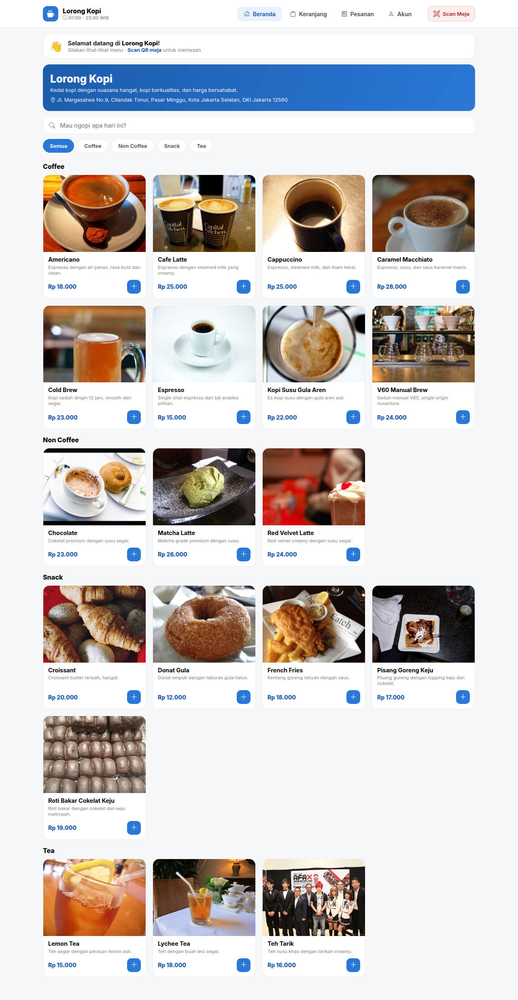 | 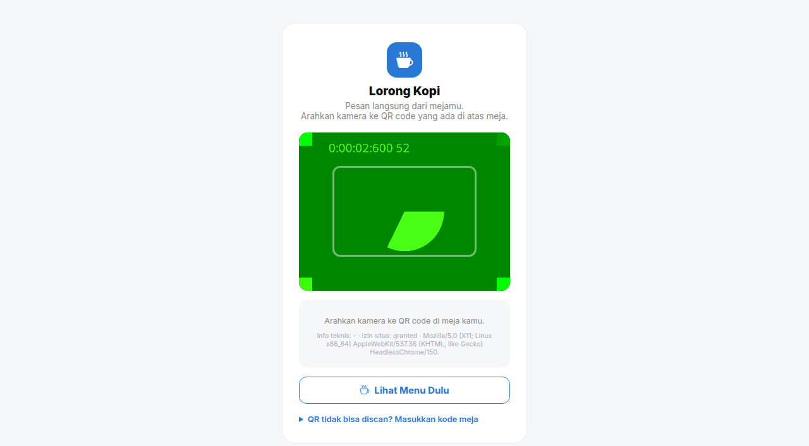 |

| Pelanggan — Menu (sesi meja aktif) | Kasir — Pesanan Baru (POS) |
|---|---|
| 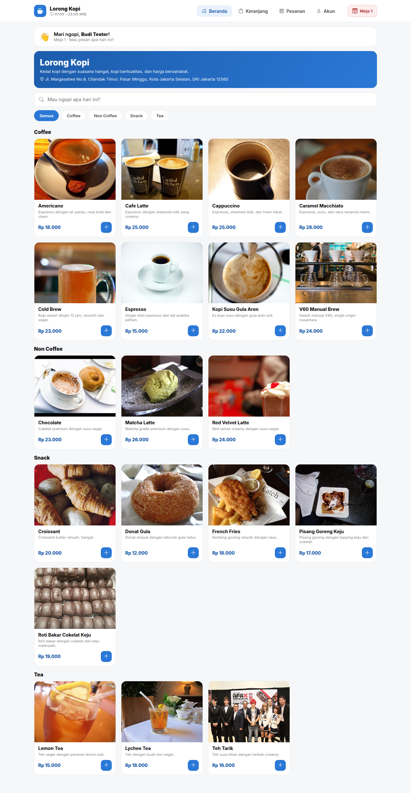 | 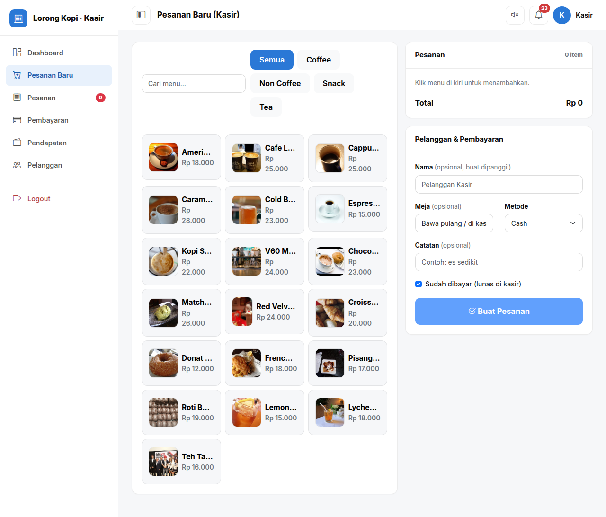 |

| Admin — Dashboard | Admin — Meja & QR |
|---|---|
| 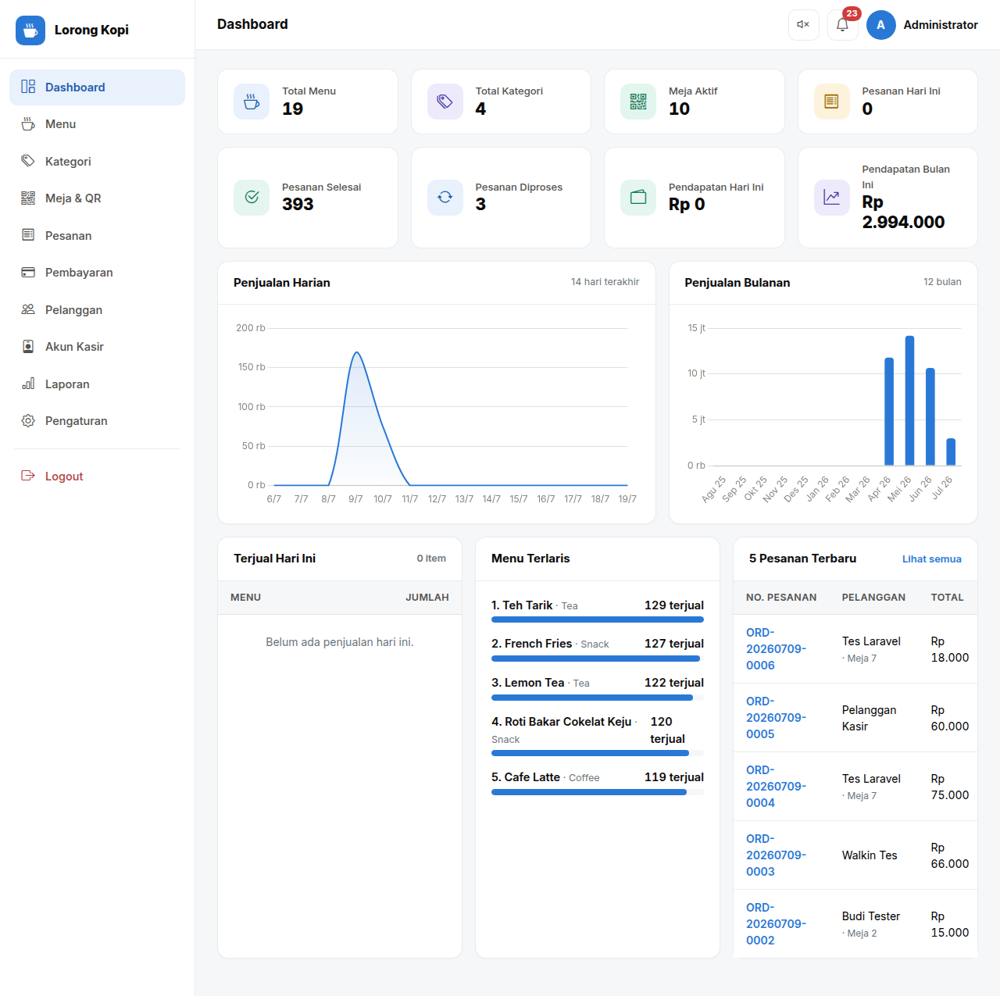 | 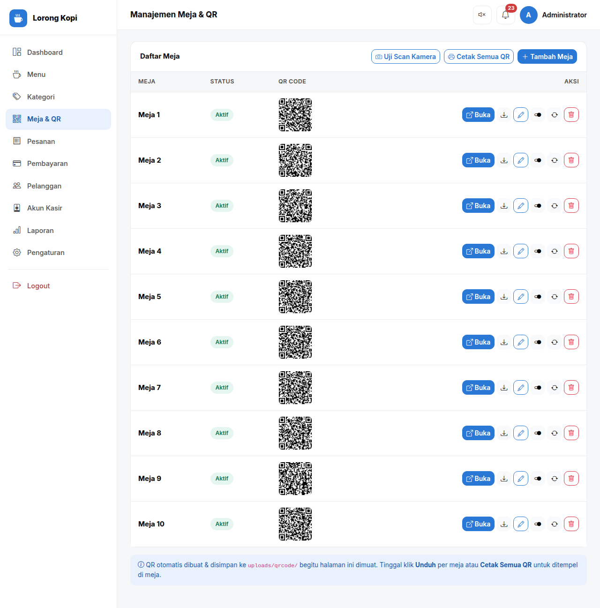 |

<details>
<summary>Screenshot lainnya (login admin, login kasir, dashboard kasir, kelola menu)</summary>

| Admin — Login | Admin — Kelola Menu |
|---|---|
| 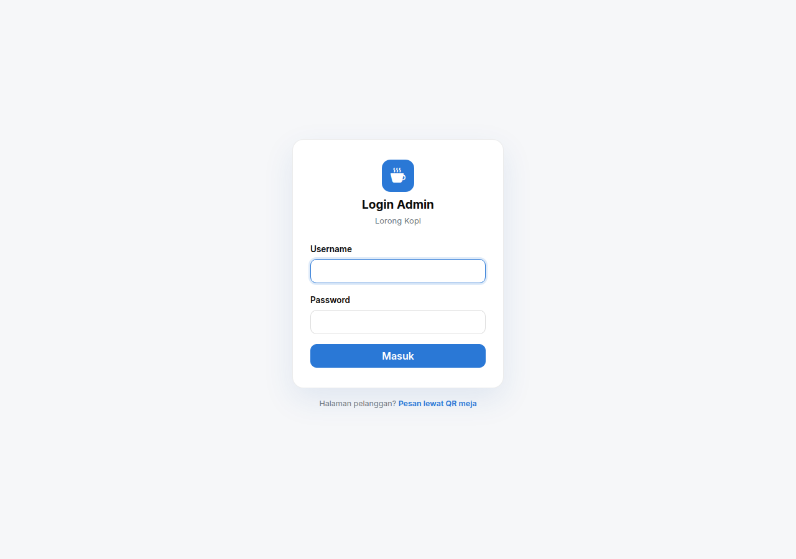 | 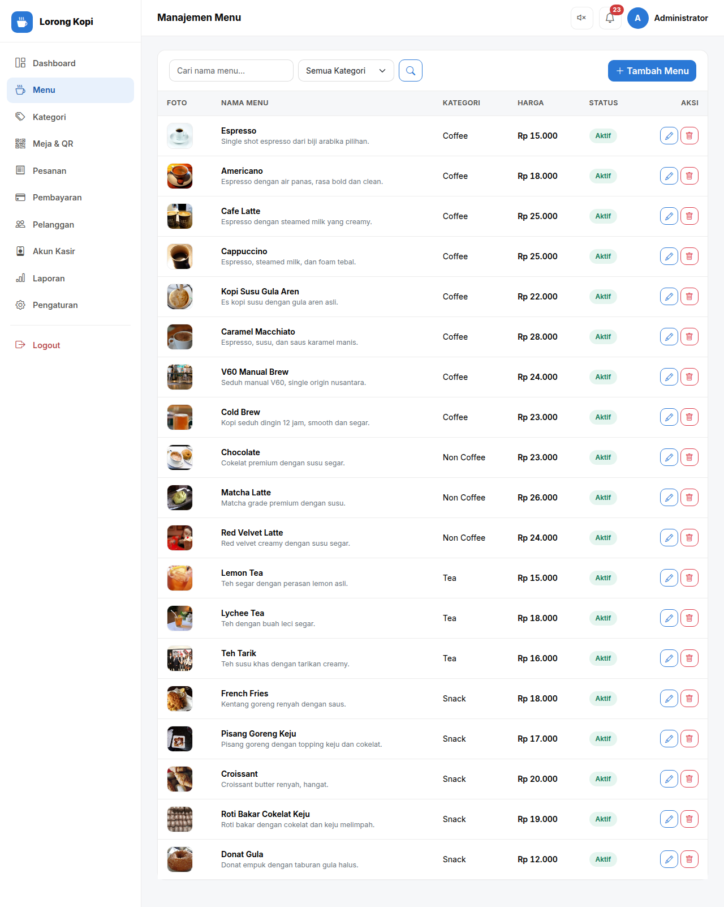 |

| Kasir — Login | Kasir — Dashboard |
|---|---|
| 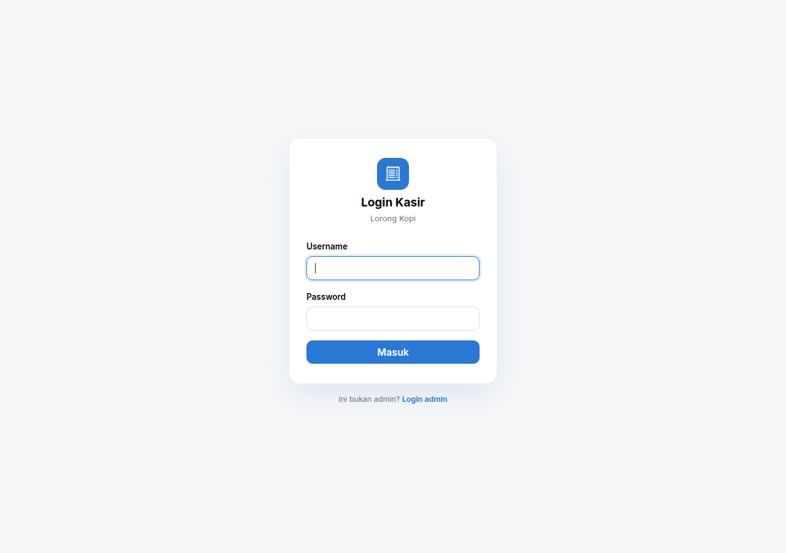 | 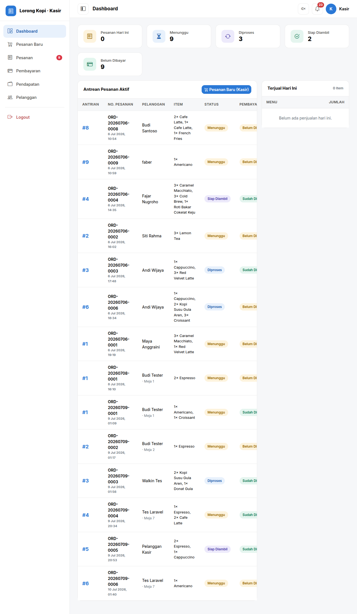 |

</details>

## Fitur

### Pelanggan (tanpa install aplikasi)
- **Lihat menu tanpa scan** — beranda & katalog menu bisa dibuka siapa saja;
  **memesan** tetap wajib scan QR/masukkan kode meja lebih dulu.
- **Scan QR langsung dari browser** — kamera aktif di halaman itu juga (tanpa
  aplikasi kamera terpisah), pakai [jsQR](https://github.com/cozmo/jsQR),
  lengkap dengan pesan error spesifik per kasus (izin ditolak, kamera tidak
  ditemukan, dibuka dari dalam aplikasi WA/IG, dll) dan input kode manual
  sebagai fallback.
- Check-in meja lewat nama + no. HP; data pelanggan disatukan lintas kunjungan
  berdasarkan no. HP.
- Katalog menu per kategori dengan pencarian & opsi minuman (ukuran
  Regular/Large, penyajian Dingin/Panas, kadar gula — menu seperti
  Espresso/Americano otomatis tanpa opsi gula).
- Keranjang & checkout (Cash/QRIS), catatan pesanan.
- Lacak status pesanan real-time dengan nomor antrian harian, + batalkan
  pesanan.
- Info WiFi kedai (bisa disalin) muncul otomatis setelah pembayaran
  terverifikasi.

### Kasir
- Login terpisah dari admin; dashboard antrean pesanan aktif + item terjual
  hari ini.
- **POS (Pesanan Baru)** — input pesanan walk-in, pilih meja/bawa pulang,
  tandai lunas, UI ramah layar sentuh.
- Proses pesanan (ubah status), verifikasi pembayaran, cetak struk (nomor
  antrian + info WiFi).
- Notifikasi dering real-time (polling AJAX + Web Audio API) saat pesanan
  masuk, badge merah jumlah antrean.
- Menu Pendapatan (rekap harian), data Pelanggan.

### Admin
- Dashboard statistik + grafik penjualan harian/bulanan (Chart.js).
- CRUD Menu (foto, kategori, opsi tanpa gula), Kategori, **Meja + generate QR**
  (cetak semua QR sekaligus, uji scan kamera langsung dari halaman ini).
- Manajemen Pesanan, Pembayaran, Pelanggan, Akun Kasir.
- Laporan penjualan (harian/mingguan/bulanan/rentang) + export Excel + cetak.
- Pengaturan toko (identitas, logo/banner, WiFi kedai).

## Tech Stack

| Komponen | Teknologi |
|---|---|
| Framework | Laravel 13 (PHP 8.3+), akses data lewat PDO mentah (bukan Eloquent) |
| Database | MySQL/MariaDB |
| Frontend | Blade + Bootstrap 5 (kasir/admin), CSS kustom (pelanggan), Bootstrap Icons |
| Build asset | Vite + Tailwind v4 (`npm run dev` / `npm run build`) |
| Grafik & QR | Chart.js, qrcode.js (generate QR), jsQR (scan QR dari kamera) |
| Realtime | Polling AJAX + Web Audio API (dering notifikasi, bukan WebSocket) |
| Server produksi | Ubuntu + nginx + PHP-FPM, Cloudflare Tunnel |

## Cara Install & Jalankan

### Native (yang dipakai sehari-hari untuk project ini)
```bash
composer install
npm install

cp .env.example .env
php artisan key:generate

# Buat database, lalu impor skema + seed data:
mysql -u root -p < database.sql
# atau: mariadb -u root -p < database.sql

# Sesuaikan kredensial DB di .env:
#   DB_CONNECTION=mysql
#   DB_DATABASE=lorongkopi_db
#   DB_USERNAME=... / DB_PASSWORD=...

php artisan serve       # http://127.0.0.1:8000
npm run dev              # kalau sedang ubah CSS/JS di resources/
```

### Akun demo (dari `database.sql`)
| Role | URL Login | Username | Password |
|---|---|---|---|
| Admin | `/admin/login.php` | `admin` | `admin123` |
| Kasir | `/kasir/login.php` | `kasir` | `kasir123` |

⚠️ **Wajib diganti** sebelum dipakai sungguhan (Admin → Akun Kasir, atau ganti
langsung isi kolom `password` di tabel `admin`/`kasir` dengan
`password_hash()`). 10 meja demo (kode QR) sudah tersedia — cetak ulang lewat
Admin → Meja & QR untuk kode yang sungguhan dipakai di kedai.

Untuk mencoba alur pelanggan tanpa scan fisik, buka langsung:
`http://127.0.0.1:8000/meja.php?kode=3d7ac1f082afe7a1` (kode meja 1 dari seed
data).

### Docker
Tidak ada Dockerfile/docker-compose di repo ini — deploy native (composer +
nginx/PHP-FPM) seperti di atas.

## Arsitektur

Bukan aplikasi Eloquent standar — ini adalah port Laravel dari aplikasi PHP
native, jadi query database ditulis manual lewat PDO (`db()` helper di
`app/Support/helpers.php`) dengan **prepared statement** di semua query, bukan
lewat Model/query builder. Route URL dipertahankan sama persis dengan versi
lama (`web.php` memetakan `index.php`, `meja.php`, dst ke controller).

```
lorongkopi-laravel/
├── app/
│   ├── Http/
│   │   ├── Controllers/
│   │   │   ├── Site/      # pelanggan: meja (check-in QR), beranda, keranjang,
│   │   │   │              # checkout, pesanan, akun
│   │   │   ├── Kasir/     # auth, dashboard, POS, pesanan, pembayaran,
│   │   │   │              # pendapatan, pelanggan, notifikasi
│   │   │   └── Admin/     # auth, dashboard, menu, kategori, meja+QR, pesanan,
│   │   │                  # pembayaran, pelanggan, akun kasir, laporan, pengaturan
│   │   └── Middleware/    # MejaAktif, KasirAuth, AdminAuth — 3 gerbang otorisasi terpisah
│   └── Support/helpers.php  # helper global: db(), rupiah(), keranjang session,
│                             # nomor pesanan/antrian, upload gambar, dll
├── resources/views/
│   ├── site/              # halaman pelanggan
│   ├── kasir/             # halaman kasir
│   ├── admin/             # halaman admin
│   └── partials/          # header/footer tiap area
├── routes/web.php         # seluruh route (URL kompatibel dgn QR yang sudah dicetak)
├── public/
│   ├── assets/            # CSS, JS (termasuk jsqr.js vendored)
│   └── uploads/           # foto menu, logo/banner toko, PNG QR meja
└── database.sql           # skema & seed data awal
```

**Kenapa PDO manual, bukan Eloquent?** Untuk mempertahankan perilaku 1:1
dengan versi non-framework saat migrasi, termasuk nama fungsi helper dan
struktur query. Konsekuensinya: tidak ada model/migration Laravel untuk tabel
inti (menu, pesanan, dst) — skema hidup di `database.sql`, bukan
`database/migrations/`.

## ERD

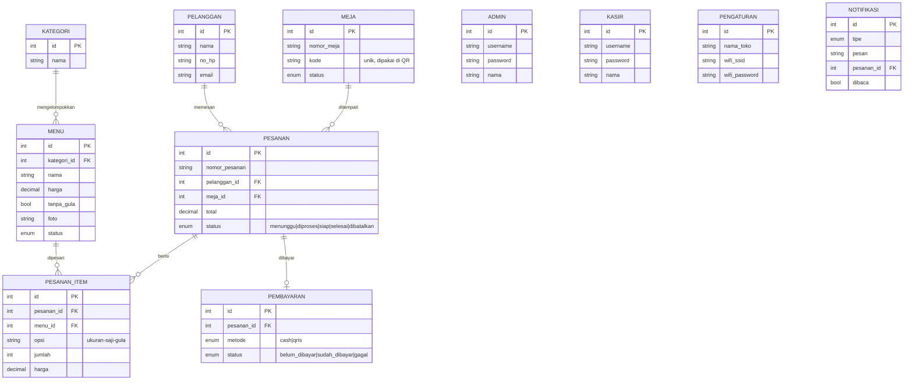

## Dokumentasi API

Tidak ada REST API/Swagger/Postman collection terpisah — semua endpoint
adalah route Blade biasa (server-rendered) ditambah beberapa endpoint AJAX
internal yang dipakai oleh JS di view yang sama:

| Endpoint | Dipakai untuk |
|---|---|
| `POST keranjang.php` (dengan header `X-Requested-With: fetch`) | Tambah item ke keranjang dari sheet opsi, balas JSON |
| `GET/POST kasir/api/notifikasi.php` | Polling notifikasi pesanan baru di dashboard kasir |
| `GET/POST admin/api/notifikasi.php` | Polling notifikasi di dashboard admin |
| `POST admin/api/simpan_qr.php` | Simpan ulang gambar QR meja yang di-generate di browser |
| `POST kamera_log.php` | Halaman scan QR mengirim laporan kendala kamera (nama error, status izin) ke `storage/logs/kamera-debug.log`, untuk debug device pelanggan |

## Cara Testing

```bash
php artisan test
```

Hasil aktual saat ini: **1 dari 2 test lulus** (`phpunit`, project skeleton
bawaan Laravel — belum ada test khusus untuk fitur kafe ini). Test yang gagal
adalah `ExampleTest` bawaan yang meng-hit `/` dan mengharapkan status 200; ia
gagal karena environment testing pakai SQLite in-memory (bawaan
`phpunit.xml`) sedangkan controller pelanggan melakukan raw query PDO ke
tabel `menu` yang skemanya cuma ada di `database.sql` (MySQL), bukan di
`database/migrations/`. Untuk menjalankan test ini dengan benar, testing DB
perlu diarahkan ke database MySQL yang sudah diimpor `database.sql`, atau
tabel-tabel tersebut perlu migration Laravel tersendiri untuk lingkungan test.

## Security Considerations

- **SQL Injection** — seluruh query (155+ pemanggilan `prepare()`/`query()` di
  `app/`) memakai *prepared statement* dengan parameter terikat; tidak
  ditemukan concatenation string user-input ke SQL.
- **XSS** — semua output ke Blade view memakai `{{ }}` (auto-escape) atau
  `e()`; tidak ada satupun penggunaan `{!! !!}` (raw/unescaped output) di
  seluruh `resources/views`.
- **Password** — di-hash dengan `password_hash()`/`password_verify()` (bcrypt),
  bukan plaintext maupun MD5.
- **Otorisasi** — tiga middleware terpisah (`MejaAktif`, `KasirAuth`,
  `AdminAuth`) menjaga area pelanggan/kasir/admin lewat session flag
  (`admin_id`, `kasir_id`, `meja`); tidak ada percampuran hak akses antar role.
- **CSRF dinonaktifkan secara global** (`bootstrap/app.php`:
  `validateCsrfTokens(except: ['*'])`). Ini keputusan sadar saat migrasi dari
  versi non-framework: seluruh form/fetch hasil port belum membawa token CSRF,
  dan menonaktifkannya menjaga perilaku identik dengan versi lama. **Trade-off
  yang perlu disadari**: form POST (checkout, login admin/kasir, dll) rentan
  CSRF selama proteksi ini tidak diaktifkan ulang per-form dengan token yang
  disisipkan ke masing-masing view.
- **Kredensial demo** (`admin/admin123`, `kasir/kasir123`) ada di seed data
  publik (`database.sql`) — **wajib diganti** sebelum instance dipakai untuk
  data sungguhan (lihat bagian Install & Jalankan).
- **Upload gambar** (`upload_gambar()` di `helpers.php`) memvalidasi ekstensi
  (jpg/jpeg/png/webp), ukuran maksimal 2 MB, dan memverifikasi file benar-benar
  gambar lewat `getimagesize()` sebelum disimpan dengan nama file baru
  (mencegah path traversal & upload file eksekutabel berkedok gambar).

## Deploy Produksi (ringkas)
1. Upload project (tanpa `.env`), `composer install --no-dev` di server.
2. Buat `.env` produksi (`APP_ENV=production`, `APP_DEBUG=false`, kredensial DB
   server).
3. Arahkan document root nginx ke `public/`, lalu jalankan
   `php artisan config:cache route:cache view:cache`.
4. Pastikan `storage/` & `bootstrap/cache/` writable oleh user PHP-FPM
   (`www-data`).

---
